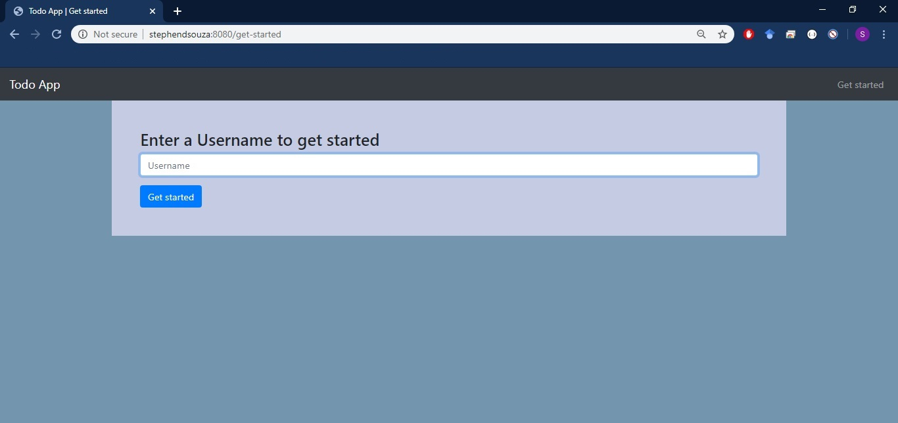
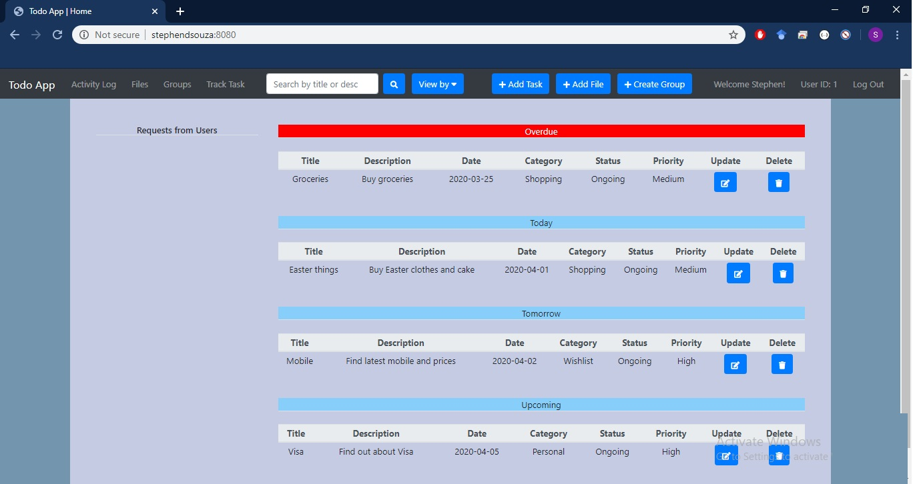
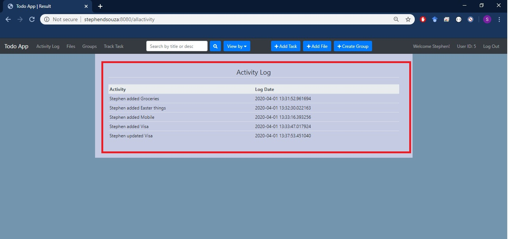
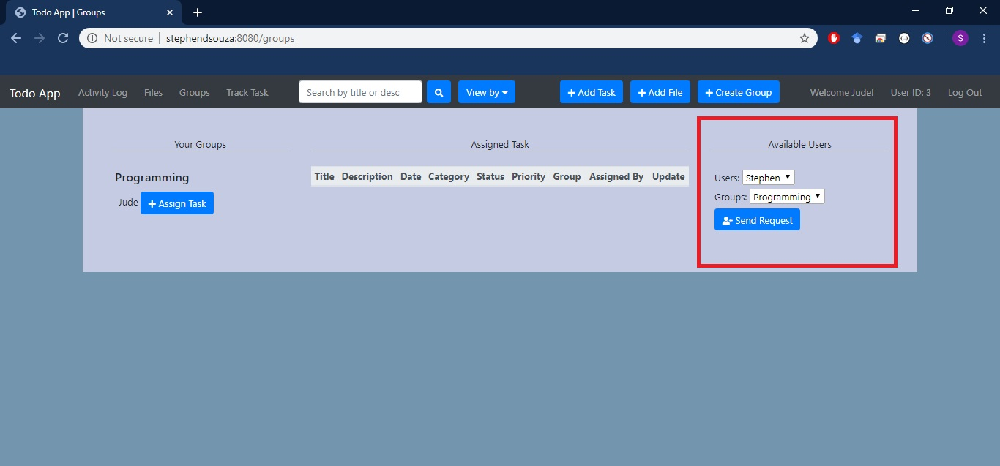
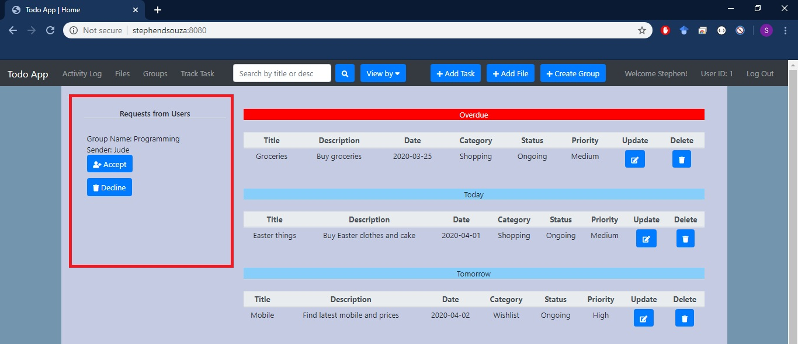
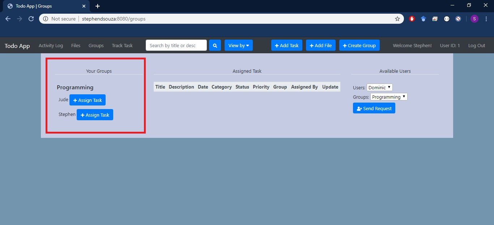
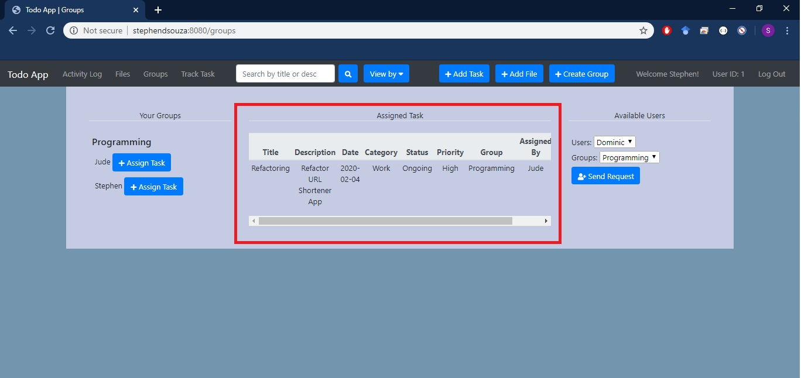
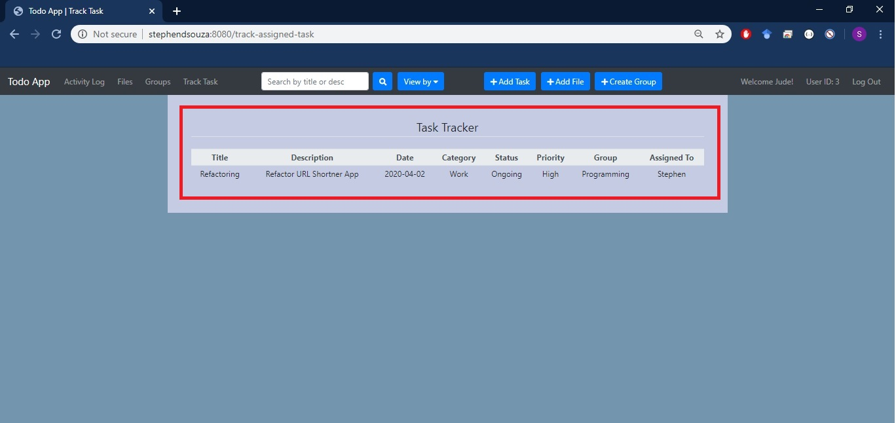

# Todo App

**A list of things to do and keep track of**

In this application, customers can add and keep track of tasks they plan to do, they can upload and download files and assign task to others as well as keep track of those task. 

**Tasks:** When customers add a task for themselves, they are able to categorize and prioritize it and once the task is completed, they can change its status. As customers open the app, they can see their task according to **overdue**, **today**, **tomorrow**, **upcoming** and/or **completed**. The task can be updated or deleted as required. The customer can also view their tasks by category, priority or status or can use the search option to find for a task. 

**Activity Log:** Customer's add and update activities are saved in the Activity Log. When a user deletes a task, the log data for that task will also be deleted.

**Files:** This app also allows customers to save important PDF files that they may need and those files can also be downloaded as well.

**Assigning Task:** Customers can create groups and send request to other users to join their groups. The receiver of the request can accept or decline the request. When the receiver of the request accepts a request, they are added to that group. Users within that group can assign tasks to each other and the user who assigned the task can keep track of the task.

## Files

Below are a summary of the files.

### Models

In the `models.py` there are several classes that inherit the Base class from SQLAlchemy in order to create tables in the DB. 

The Customer class contains methods for performing SQL statements mainly add, update, delete and/or select for interacting with the DB.

The SQLBackend class is responsible for creating an engine. In case the engine has already been created then it will be returned. The bootstrap method will connect to the engine and after a successful connection, it will create the tables in the DB. If the engine does not successfully connect to the DB then it will retry and then return an error.

### Core

In the `core.py`, the Controller class inherites the SQLBackend class and composites the Customer class. This class includes all the methods from the Customer class. 

The purpose of the Controller is to mainly connect to the SQLBackend and use the session as well as to link to the Customer class to perform the customer activities. The handle session decorator is responsible for handling the session for each method in the Controller class.

### Server

In the `server.py`, the controllor object connects to the DB through the bootstrap method. The `server.py` is also responsible for creating and running the server.

The routes are mapped to their respective functions and the functions call the methods from the Controller class. The functions perform a GET, POST, PUT and DELETE requests over HTTP REST and returns results in the HTML files.

### Templates

The templates contains all the necessary HTML files for the user interface.

**Get Started**



**Main Page**



**Activity Log**



**Files**


**Sending Request**



**Received Request**



**Users in a Group**



**Assigned Task**



**Tracking Task**



## How to run locally

First run `server.py` (This will start the app and create the tables in the DB)

```

>> python server.py
Serving on http://StephenDsouza:8080

```

then run `insert.py` (This will add the pre-defined data in the Category, Priority, Status and Available Activities tables)

```

>> python insert.py

```

and then run `server.py` again (Now the app can be used with the pre-defined data)  

```

>> python server.py
Serving on http://StephenDsouza:8080

```

**Pre-defined Categories**

1. Default
2. Personal
3. Shopping
4. Wishlist
5. Work

**Pre-defined Priorities**

1. High
2. Medium
3. Low

**Pre-defined Status**

1. Completed
2. Ongoing

**Pre-defined Available Activities**

1. Added
2. Updated

## Install Dependencies

The dependencies are saved in the requirements.txt file. 

It can be installed via the following command:

```

>> pip install -r requirements.txt

```